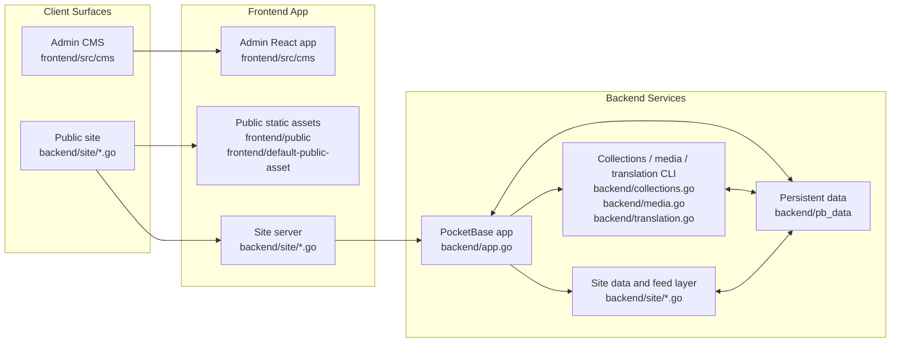

<!-- START doctoc generated TOC please keep comment here to allow auto update -->
<!-- DON'T EDIT THIS SECTION, INSTEAD RE-RUN doctoc TO UPDATE -->
**Table of Contents**  *generated with [DocToc](https://github.com/thlorenz/doctoc)*

- [alleycat](#alleycat)
  - [Structure](#structure)
  - [Architecture](#architecture)
  - [Usage](#usage)
    - [docker-compose (recommended)](#docker-compose-recommended)
    - [Local (without Docker)](#local-without-docker)
  - [Services and Ports](#services-and-ports)
  - [Persistent Data](#persistent-data)
  - [Initial Setup](#initial-setup)
  - [Public Assets Fallback](#public-assets-fallback)
  - [Admin Settings](#admin-settings)
  - [Notes](#notes)

<!-- END doctoc generated TOC please keep comment here to allow auto update -->

# alleycat

<table>
  <tr>
    <td>
      
    </td>
    <td>
      
    </td>
  </tr>
</table>

<table>
  <tr>
    <td>
      
    </td>
    <td>
      
    </td>
  </tr>
</table>

This is a PocketBase-backed blog app with a public site and a WYSIWYG admin CMS.

## Structure
- `backend/` PocketBase (Go) server.
- `frontend/` Vite + React public site and admin CMS (separate port).

## Architecture


- `frontend/src/cms` contains the admin CMS, including editor UI, settings, and admin-specific styles.
- `frontend/src/cms/lib` and `frontend/src/cms/utils` contain PocketBase access and reusable helpers for the admin app.
- `backend/site/*.go` serves the public app, while `/admin` is served separately on the admin port.
- `backend/app.go` starts PocketBase, and `backend/site/*.go` provides feed, sitemap, robots, and public-site data shaping.
- `backend/pb_data` stores PocketBase data in local runs, and the same data is mounted via Docker volume in containerized runs.

## Usage
### docker-compose (recommended)
1. `cd alleycat`
2. Generate a token for static regeneration and save it in `.env`:
   ```
   printf 'STATIC_REGEN_TOKEN=%s\n' "$(openssl rand -hex 32)" > .env
   ```
   If `.env` already exists, append instead:
   ```
   printf '\nSTATIC_REGEN_TOKEN=%s\n' "$(openssl rand -hex 32)" >> .env
   ```
3. `docker-compose up --build` (builds and starts services)
4. Open PocketBase admin UI at `http://127.0.0.1:8091/_/`.
5. Complete initial setup (see "Initial Setup" below).

### Local (without Docker)
1. Start PocketBase:
   - `cd backend`
   - `go run .`
2. In another terminal, start the frontend:
   - `cd frontend`
   - `npm install`
   - `npm run dev`
3. If PocketBase is not on `http://127.0.0.1:8091`, set `VITE_PB_URL`.

## Services and Ports
- `8091`: PocketBase API + Admin UI (`/_/`)
- `8888`: Public site (site server)
- `5175`: Admin UI web app

`/admin` is not served by the public site. Access the CMS directly via the admin port/URL.

## Persistent Data
- Docker: stored in the named volume `pb_data` mounted at `/pb/pb_data`.
- Local (no Docker): stored in `alleycat/backend/pb_data`.

## Initial Setup
1. Open PocketBase admin UI at `http://127.0.0.1:8091/_/`.
2. Create the first PocketBase superuser (email + password).
3. Alternative (recommended for first launch): use the auto-generated one-time URL shown in the PocketBase logs on first boot.
   Example:
   ```
   2025/03/23 02:37:45 Server started at http://127.0.0.1:8091
   ├─ REST API:  http://127.0.0.1:8091/api/
   └─ Dashboard: http://127.0.0.1:8091/_/

   (!) Launch the URL below in the browser if it hasn't been open already to create your first superuser account:
   http://127.0.0.1:8091/_/#/pbinstal/<temporary-token>
   (you can also create your first superuser by running: ./pocketbase superuser upsert EMAIL PASS)
   ```
   Open the URL in a browser to access the superuser creation screen directly.
4. In the `cms_users` collection, create users with roles:
   - `admin`
   - `editor`
   - `viewer`
5. Log into the CMS at `http://127.0.0.1:5175` (or the deployed admin URL).
6. Ensure public content is published so it appears on the public site.

## Public Assets Fallback
- The site server serves static files from `frontend/public` by default.
- If `frontend/public` is empty, it automatically falls back to `frontend/default-public-asset`.
- Default assets live in `frontend/default-public-asset` (`styles.css`, `default-hero.svg`, `default-pattern.svg`).
- Add your own assets to `frontend/public` to override the defaults.

## Admin Settings
The following settings are editable in the Admin UI:
- Site name
- Description
- Welcome text
- Home top image
- Home top image alt
- Footer HTML
- Theme (Ember, Terminal, Wiki, Docs, Minimal). Disabled when `frontend/public` has assets.
- Site URL (feeds)
- Site language
- Enable post translation
- Translation source locale
- Translation target locales (multiple)
- Gemini model
- Translation requests/minute
- Feed items limit
- Excerpt length
- Enable RSS/Atom feed
- Enable JSON feed
- Enable code highlight
- Highlight theme
- Home page size
- Archive page size
- Show table of contents
- Show archive tags
- Show tags
- Show categories
- Show related posts
- Show archive search slot
- Enable analytics
- Analytics URL
- Analytics site id
- Enable ads
- Ads client
- Enable comments
- Comment script tag (utterances/giscus)
- Gemini API key
  Note: only users with the `admin` role can view or update the Gemini API key because it is stored in the `app_secrets` collection. Users with the `editor` role can edit the main settings record but cannot manage that secret.

### Post Translation Migration
- Existing posts can be translated with:
  - `cd backend`
  - `go run . translate-posts`
- This command reads translation options from `settings` and the Gemini API key from `app_secrets`.
- Gemini retry behavior is capped at 3 attempts per translation request.

### Sitemaps
- Default sitemap:
  - `/sitemap.xml`
  - Includes home, archive, feeds, published pages, and published source posts.
- Localized sitemaps:
  - `/sitemap-<locale>.xml` (example: `/sitemap-en.xml`, `/sitemap-zh-cn.xml`)
  - Generated for locales listed in `Translation locales`.
  - Includes published translated posts for that locale.

### robots.txt
- Served dynamically at `/robots.txt` by SSR.
- Default policy:
  - `User-agent: *`
  - `Allow: /`
- `Sitemap` directives are added automatically:
  - `/sitemap.xml`
  - `/sitemap-<locale>.xml` for locales listed in `Translation locales`.

### Backup Zip Import (CLI)
- You can import a PocketBase backup zip directly via command line:
  - `cd backend`
  - `go run . import-backup /path/to/pb_backup_xxx.zip`
- You can backfill media checksums (SHA-256) for duplicate-aware uploads:
  - `cd backend`
  - `go run . backfill-media-checksum`
  - This command also rewrites upload paths to checksum-based keys (for example `/uploads/<sha256>.png`) to avoid filename collisions.
- In Docker container:
  - `docker-compose run --rm pocketbase /pb/pocketbase backfill-media-checksum`
  - `docker exec -it alleycat-pocketbase-1 /pb/pocketbase import-backup /pb/pb_data/backups/pb_backup_xxx.zip`
- The command replaces `pb_data` content from the specified zip (excluding `backups`, temp/cache internal dirs).
- Run this while the main PocketBase server process is stopped.

#### Docker Compose Import Steps
From the repository root (`alleycat`):
1. `docker compose stop pocketbase`
2. `docker compose run --rm -v "$PWD:/work" pocketbase /pb/pocketbase import-backup /work/pb_backup_xxx.zip`
3. `docker compose up -d pocketbase`

#### Important Backup Note
- PocketBase backup zip covers `pb_data` only.
- Custom frontend assets such as `frontend/public` CSS, images, and other static files are **not included** in the DB backup zip.
- Back up `frontend/public` separately (e.g. Git, tar/zip, or storage snapshot).

## Notes
- Public API exposure is controlled by PocketBase rules.

## Directory Tree
Build outputs and local runtime data such as `frontend/node_modules`, `frontend/dist`, and `backend/pb_data` are omitted below.

```text
.
├── .github/                    # GitHub Actions and repository automation
│   └── workflows/              # CI workflow definitions
├── backend/                    # PocketBase app and Go-based public SSR
│   └── site/                   # Public site rendering, feeds, sitemap, robots, revalidation
├── frontend/                   # Admin frontend and public static assets
│   ├── default-public-asset/   # Fallback public assets when frontend/public is empty
│   │   └── themes/             # Built-in public themes
│   ├── docker/                 # Dockerfiles and nginx config for frontend services
│   ├── public/                 # Optional user-supplied public assets
│   └── src/                    # Admin frontend source
│       └── cms/                # Admin app modules
│           ├── features/       # Admin feature screens and feature-specific logic
│           │   ├── auth/       # Login and role gate
│           │   ├── editor/     # Rich editor, media upload, markdown/html helpers
│           │   │   ├── components/ # Editor UI pieces
│           │   │   └── hooks/  # Editor-only hooks
│           │   ├── layout/     # Admin shell layout
│           │   ├── pages/      # Static page management UI
│           │   ├── posts/      # Post management and translation UI
│           │   └── settings/   # Site/admin settings UI
│           ├── lib/            # Admin-side service access such as PocketBase client
│           ├── styles/         # Admin CSS
│           ├── ui/             # Shared admin UI primitives
│           └── utils/          # Admin utility helpers
├── docker-compose.yml          # Local multi-service composition
├── LICENSE                     # License file
├── README.md                   # Project documentation
├── package-lock.json           # Root npm lockfile for repo-level tooling
└── package.json                # Root npm package for repo-level tooling
```
